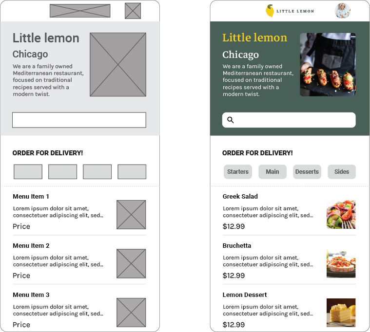

    

<h1 align="center">Meta Android Developer Capstone</h1>

    
    
    
    

> To be honest, I'm not interested in mobile app development, but I completed this specialization to fulfill the requirements of getting the [Meta Generalist Software Engineer Certificate](https://www.credly.com/org/coursera/badge/meta-generalist-software-engineer-certificate).

## Description

This is the capstone project of [Meta Android Developer Certificate](https://www.coursera.org/professional-certificates/meta-android-developer) teached by [Meta](https://www.facebook.com/business/learn/app-developer-certificate-coursera) which includes the following courses:

- [Introduction to Android Mobile Application Development](https://www.coursera.org/learn/introduction-to-android-mobile-application-development?specialization=meta-android-developer)
- [Version Control](https://www.coursera.org/learn/introduction-to-version-control?specialization=meta-android-developer)
- [Programming Fundamentals in Kotlin](https://www.coursera.org/learn/meta-programming-fundamentals-kotlin?specialization=meta-android-developer)
- [Principles of UX/UI Design](https://www.coursera.org/learn/principles-of-ux-ui-design?specialization=meta-android-developer)
- [Create the User Interface in Android Studio](https://www.coursera.org/learn/create-the-user-interface-android-studio?specialization=meta-android-developer)
- [Advanced Programming in Kotlin](https://www.coursera.org/learn/advanced-programming-in-kotlin?specialization=meta-android-developer)
- [Working with Data in Android](https://www.coursera.org/learn/working-with-data-in-android?specialization=meta-android-developer)
- [Mobile Development and JavaScript](https://www.coursera.org/learn/mobile-development-and-javascript?specialization=meta-android-developer)
- [React Basics](https://www.coursera.org/learn/react-basics?specialization=meta-android-developer)
- [React Native](https://www.coursera.org/learn/react-native-course?specialization=meta-android-developer)
- [Android App Capstone](https://www.coursera.org/learn/android-app-capstone?specialization=meta-android-developer)
- [Coding Interview Preparation](https://www.coursera.org/learn/coding-interview-preparation?specialization=meta-android-developer)

## Wireframe

    

